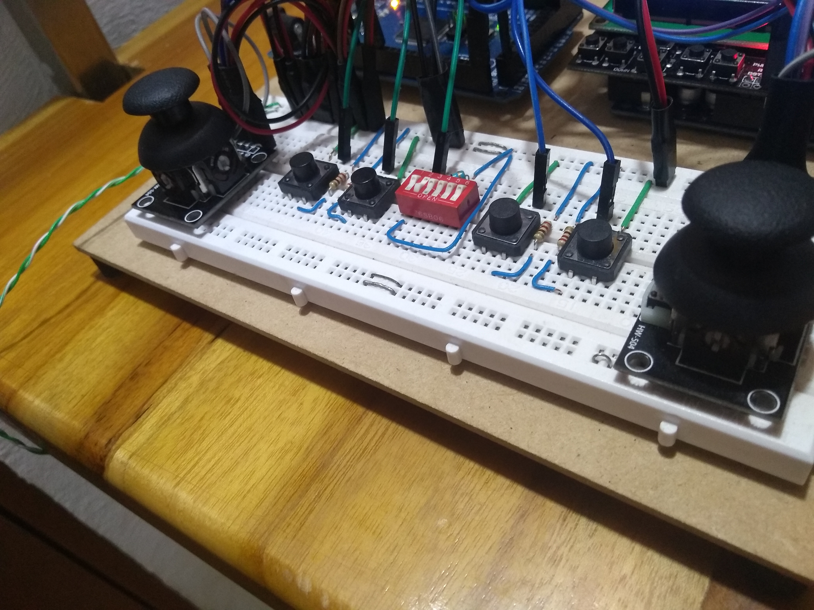

# PROYECTO BRAZO ROBOTICO CON DISPLAY LCD

# Materiales
- 3 Servomoteres MG996r (180 grados)
- 3 Servomoteres SG90 (180 grados)
- Estructura del brazo 
- Protoboard 
- 2 Joysticks
- 4 Pulsadores 
- Un switch
- 4 Resistenacias de 500 Ohs 
- Display LCD 16x2(shield keypad)
- Cables (MUCHOS cables)
- Arduino Mega

# Descripcion del proyecto
El proyecto del brazo robotico cuenta con dos modos de operacion: Un modo automatico en el que el brazo realiza una tarea que fue previamente programada por el diseñador, y un modo manual, en el cual el brazo puede ser controlado por un operario mediante los Joisticks y los pulsadores. Tambien cuenta con un display LCD el cual le indica al operacio en que modo de operacion se encuentra el brazo. Si se desea cambiar la rutina que realiza el brazo en su modo automatico se deben de dirigir a archivo codigo fuente, para seguidamente dirigirse al apartado donde se encuentra declarada una funcion llamada automatico(), una vez puede modificar todo lo que se encuentre dentro de la funcion para asi conseguir que el brazo realice lo que usted como programador desee

# Archivos de impresion
Para la impresion 3d dentro de la carpeta Impresion3d se dejaron los archivos utilizados para la impresion del presente brazo dentro de un .rar

# Conexion Joistick 1
Los Joisticks suelen tener los pines de alimentacion los cuales se identifican con GND y 5v, estos van conectados al positivo y negativo de la fuente de alimentacion. Los pines Vry y Vrx van los pines A0 y A1 del arduino mega respectivamente

# Conexion Joistick 2
De la misma manera que los Joisticks anteriores los pienes 5v y GND van conectados a la alimentacion y al negativo de la fuente respectivamente, y los pines Vrx y Vry van a los pines A14 y A15 del arduino mega respectivamenrte

# Conexion motor de la base
Generalemente los servomotores tienen tres pines de conexion, los cuales son 5v, GND y señal. Los pines de 5v y GND van al 5v y la tierra de la fuente de alimentacion y el pin de señal(mediante el cual controlamos el giro del motor) va conectado al pin digital 6 del arduino mega

# Conexion motor del hombro 
El pin de señal del motor encargado de controlar el movimiento de la articulacion del hombro va conectado al pin digital 7 del arduino mega.

# Conexion motor del codo
El pin de señal de dicho motor va conectado al pin digital 8 del arduino mega 

# Conexion de motor del muñeca (movimiento en Y)
En este proyecto la articualcion de la muñeca tiene dos motores, uno que se encargar de hacer el movimiento en el eje Y, y el otro motor encargado de darle moviento de rotacion a dicha articulacion. Para el motor encargado de darle el moviento en en eje Y, conectaremos el pin de señal al pin digital 10

# Conexion de motor de la muñeca (moviento de rotacion)
En el codigo dicho la declaracion de dicho motor se coloca como moviento en X, y va conectado al pin digital 9 del arduino mega

# Conexion motor de la pinza
El pin de señal de dicho motor va conectado al pin digital 11 del arduino mega

# Conexion del shiel keypa y el arduino uno
En este proyecto se utilizo el arduino uno como controlador para el display LCD, esta forma aunque no es la mas adecuada es la que se disponia y por ende la que se implemento, aunque es mucho mejor utilizar un display LCD que ya se encuentre adaptado para comunicacion I2C directamente, en cuyo caso el codigo del display LCD cambiaria un poco. Como se mensiono previamente, en este proyecto se utilizo el shield keypad LCD, el cual va conectado al arduino tal como se muestra en la siguiente figura

El arduino uno a su vez se comunica con el arduino mediante protocolo I2C, para los grar dicha conminicacion es necesario conectar los pines A4 y A5 del arduino uno a los pines digitales 20 y 21 del arduino mega respectivamente y adicionalmente es requerido que se realice la conexion del 5v y GND del arduino uno al positivo y negativo de la fuent de alimentacion, esto debido a que tanto el mega como el uno son alimentados por una fuente de 5v a 1.5A(Si se dispone de una fuente de 3A o 4A el brazo funciona mucho mejor)

# Conexion del Arduino mega
Como se comento anteriormente el proyecto es alimentado mediante una fuente de 5v, asi que el arduino mega es necesario conectarlo tambien al positivo y negativo de la fuente de la misma manera que se hacia con el arduino uno 

# Fin
Para finalizar este archivo README, le deseo a todo el que se embarque en este proyecto mucha suerte y animo y les digo que: ¡SI PUEDES IMAGINARLO, PUEDES PROGRAMARLO!

